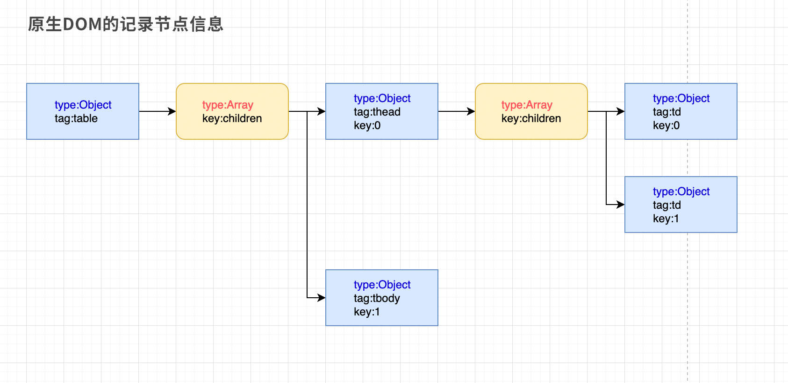

# Xhear 文档

## Xhear的基础原理和使用

先搞清楚 Xhear 使用 `$` 得到的是什么东西；

```html
<table class="target">
    <thead>
        <td>人物</td>
        <td>年龄</td>
    </thead>
    <tbody>
        <tr>
            <td>孙悟空</td>
            <td>512</td>
        </tr>
        <tr>
            <td>沉香</td>
            <td>24</td>
        </tr>
    </tbody>
</table>

<script>
    var tEle = $(".target");

    console.log(tEle.tag); // => table
    console.log(tEle.length); // => 2
</script>
```

[点击进入 案例table_test](https://kirakiray.github.io/Xhear/readmeSource/table_test.html)，打开调试模式查看console;

`$` 使用方法和 jQ的类似，是从 `document.querySelector` 获取到的对象，再通过 `Xhear` 实例化；

案例中通过 `$` 得到是 table元素；它的 tag名是 `table`；这时获取它的 `length` 属性值是2，证明得到的是个数组；但数组里到底是什么？我们调试查看试一下；

```javascript
console.log(tEle[0].tag); // => thead
console.log(tEle[1].tag); // => tbody
```

从 `tag` 名发现，似乎是它的两个子元素(thead 和 tbody)；再来测试一下是不是它的子元素；

```javascript
console.log("is equal => ", tEle[0] === $("thead")); // => true
```

通过 `$` 获取的元素对象，其本身会和 `children`数组是一体的；没有额外的children，数据冒泡将会简单，数据结构变得清晰；




## 这样做有什么好处呢？

### 可以直接使用数组的方法来操纵DOM

比如之前案例提到的，可以直接使用sort对节点进行排序；

```javascript
$('tbody').sort((a, b) => {
    // tbody下的是tr；而tr的第二个子元素td的文本就是age
    return a[1].text - b[1].text;
});
```

当要去除某个子节点时，可以使用 `splice`；

```javascript
// 去除第一个子元素
$('tbody').splice(0,1);
```

添加新元素就是 push

```javascript
$('tbody').push({
    tag:"tr",
    0:{
        tag:"td",
        text:"八戒"
    },
    1:{
        tag:"td",
        text:"800"
    }
});
```

能使用很多 `Array`上的方法，下面列举一下：

* pop
* push (相对DOM来说就是appendChild)
* shift
* unshift
* splice
* sort
* reverse

当然，也能使用不影响数组结构的方法，如'concat', 'every', 'filter', 'find', 'findIndex', 'forEach', 'map', 'slice', 'some', 'indexOf', 'includes', 'join'；

### 数据就是界面，界面就是数据

看了后面的 自定义组件 就会知道了，会把无用的数据过滤，只保留必要的数据；

### 更方便做数据同步

因为合并和数组和对象两种类型；元素对象没有childs层，使数据同时具备xml和json的优势；

还可以使用 `stanz` 提供的数据流操控方法，具体查看 [stanz数据同步使用方法](https://github.com/kirakiray/stanz/blob/master/doc/cn/method_about_data.md)；Xhear 就是继承 stanz 开发的，Xhear的实例化对象能使用stanz提供的方法；

## [Xhear实例属性](./xhear_atr.md)

可以使用类似 jQuery 的 api，只不过是把方法变成了属性；例如 `html`、`text`、`width`、`height` 等等；[点击查阅](xhear_atr.md)。

## [Xhear实例方法](xhear_method.md)

同样也包含类似 jQuery 的方法，例如 `before`、`after`、`remove`等等；`append` 和 `prepend` 换成 `push` 和 `unshift`；[点击查阅](xhear_method.md)。

## [Xhear自定义组件](xhear_components.md)

这里先展示最简单的自定义组件；

```html
<!DOCTYPE html>
<html lang="en">

<head>
    <meta charset="UTF-8">
    <meta name="viewport" content="width=device-width, initial-scale=1.0">
    <meta http-equiv="X-UA-Compatible" content="ie=edge">
    <title>test-tag</title>
    <script src="../dist/xhear.js"></script>
    <script>
        $.register({
            tag: "test-tag",
            temp: `
                <div style="background-color:#aaa;">
                    <h2>test-tag</h2>
                    <div x-content style="font-size:18px;color:red;"></div>
                </div>
            `
        });
    </script>
</head>

<body>
    <test-tag x-ele>测试文本</test-tag>
</body>

</html>
```

查看 [test-tag案例](https://kirakiray.github.io/Xhear/readmeSource/test-tag-com.html)

这是一个最简单的静态模板，没有交互逻辑，只是自动填充了html元素，后面会有更多组件交互逻辑，但知识点很少，你很快就会学会组件怎么写；

[点击查阅](xhear_components.md)