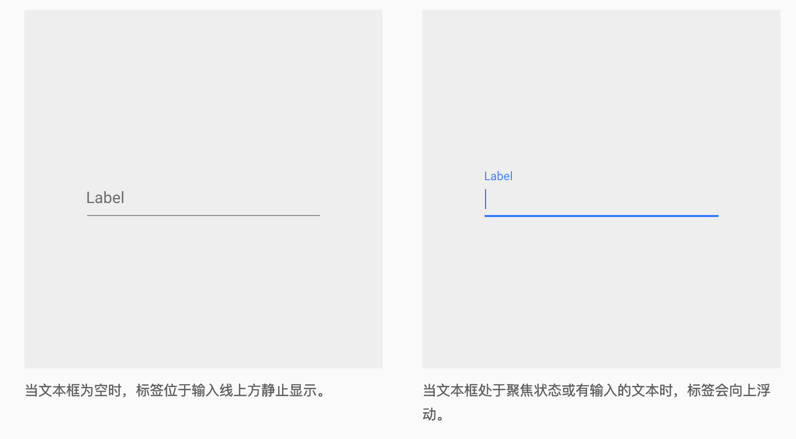
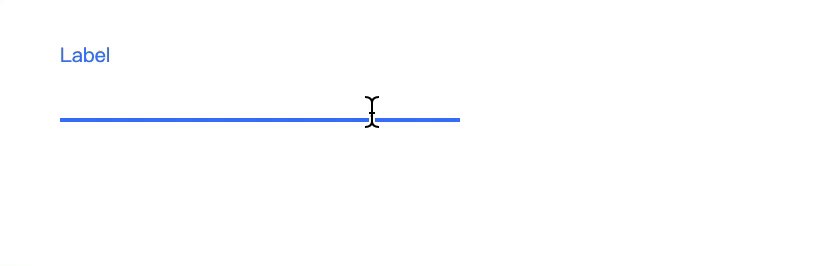
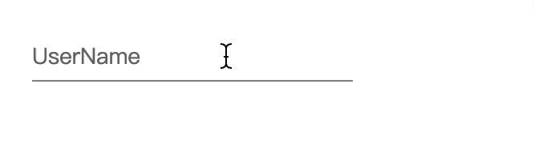
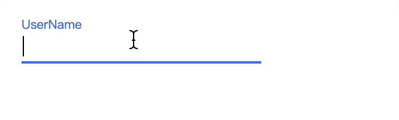
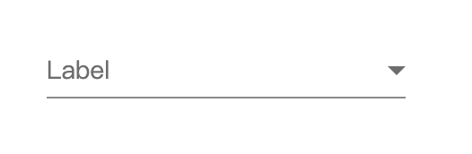
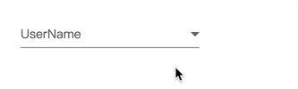

# Xhear组件编写

下面列出知识点，看完就是掌握90%的 Xhear组件的开发了；

注册组件的属性：

* attrs
* props
* data
* watch
* proto

生命周期callback：

* inited
* attached
* detached

模板语法：

* `{{keyName}}` 文本渲染模板语法；
* `xv-content` 和 `xv-slot` 插槽元素；
* `xv-tar` 暴露影子元素；
* `xv-module` 绑定value数据；

下面以谷歌 Material Design 的 输入线 为案例做个控件；(案例中没有使用模块化和模板引用，后面的XDFrame会补充解决这两个问题；只是简单的 `script`标签引用方便理解)



或者不想看案例，直接拉到最后看[总结](#总结)；

首先把基础的静态模板写出来；

**注意！！！！** 注册组件不能出现大写字符，element标签不能识别大写字母，请使用 `-` 分开词义；

这里定义组件名 `input-line`；

主体的元素就三个；

```html
<input-line>
    <!-- 主体输入框 -->
    <input type="text" class="main_input">
    <!-- 底部线 -->
    <div class="bottom_line"></div>
    <!-- placeholder提示元素 -->
    <div class="tips_text">Label</div>
</input-line>
```

[点击查看 input-line 静态模板(html+css)](https://kirakiray.github.io/Xhear/readmeSource/input_line/static.html)；

那么 `input-line` 的最基础静态组件就这么定义：

```html
$.register({
    tag: "input-line",
    temp:`
    <input type="text" class="main_input">
    <div class="bottom_line"></div>
    <div class="tips_text">Label</div>
    <div xv-content></div>
    `
});
```

**tag** 自定义标签名；

**temp** 存放自定义组件的模板元素；

`temp` 里加了个 `<div xv-content></div>` 是用于存放 content元素；**所有的组件都必须带有 `xv-content` 的元素**；至于有什么用后面会讲；

[点击查看 input-line 组件](https://kirakiray.github.io/Xhear/readmeSource/input_line/inputLineTest.html)；

下面开始添加基础交互；

```javascript
$.register({
    tag: "input-line",
    temp: `
    <input type="text" class="main_input" xv-tar="mainInput">
    <div class="bottom_line"></div>
    <div class="tips_text">Label</div>
    <div xv-content></div>
    `,
    data: {
        // 默认istat为空
        istat: ""
    },
    attrs: ["istat"],
    inited() {
        this.$mainInput.on("focus", e => {
            // mainInput聚焦时，修改istat属性为infocus
            this.istat = "infocus";
        });
        this.$mainInput.on("blur", e => {
            // mainInput失去焦点时，清空istat
            this.istat = "";
        });
    }
});
```

**inited** 元素初始化完成后，会进入 `inited` 方法内， `this` 指向的就是初始化后的组件元素；

**data** 定义组件自身的默认数据；

**attrs** 定义自身数据的 `key`值 是否映射到元素属性上；案例中通过css定义了 `istat` 属性修改组件的界面变化；

组件的 `xv-tar` 定义了影子元素在组件上的key；而要使用该元素只需要前置 `$` 符即可；方便实例函数快速调用影子元素；

temp模板内，给 `.main_input` 添加了 `[xv-tar="mainInput"]` 属性；使用元素只需要 `$mainInput` 获取；

内元素渲染完成后`(inited后)`，给内部的的 `input` 元素注册 聚焦和失焦 (focus blur)事件，修改元素的 `istat` 值；

而 `istat` 的值绑定组件元素的外部属性，css上定义了改动的样式变化；

```css
input-line[istat="infocus"]>.bottom_line {
    background-color: #4078f6;
    height: 2px
}

input-line[istat="infocus"]>.tips_text {
    top: -18px;
    font-size: 10px;
    color: #4078f6
}
```

效果查看

```html
<input-line xv-ele></input-line>
```



### 特性说明

`temp` 填充到元素内的模板元素被称为 `影子元素`；通过debug工具可以查看到，模板元素上都会带 `xv-shadow` 属性，外部是无法通过`que`获取影子元素；但通过提供的 `queShadow` 可以查找组件自身的影子元素；

```javascript
$('input-line').que('.main_input'); // => null
$('input-line').queShadow('.main_input'); // => {tag:"input",...}
```

外部也可以使用组件的快捷影子元素：

```javascript
$("input-line").$mainInput // => {tag:"input",...}
```

接下来自定义文本的 `placeholder` 值；

```javascript
$.register({
    tag: "input-line",
    temp: `
    <input type="text" class="main_input" xv-tar="mainInput">
    <div class="bottom_line"></div>
    <div class="tips_text">{{placeholder}}</div>
    <div xv-content></div>
    `,
    data: {
        // 默认istat为空
        istat: "",
        // placeholder默认值
        placeholder: "Label"
    },
    attrs: ["istat", "placeholder"],
    inited() {
        this.$mainInput.on("focus", e => {
            // mainInput聚焦时，修改istat属性为infocus
            this.istat = "infocus";
        });
        this.$mainInput.on("blur", e => {
            // mainInput失去焦点时，清空istat
            this.istat = "";
        });
    }
});
```

组件 `temp` 内的 **{{keyName}}** 会被渲染成 `文本元素`，文本内容是组件相应的key值；

效果查看

```html
<input-line placeholder="UserName" xv-ele></input-line>
```



### 特性说明

在使用组件时，直接设置的属性key在组件 `attrs` 内时，会变成该实例组件的默认数据；

接下来到定义组件的 `value` 值；

```javascript
$.register({
    tag: "input-line",
    temp: `
    <input type="text" class="main_input" xv-tar="mainInput" xv-module="iVal">
    <div class="bottom_line"></div>
    <div class="tips_text">{{placeholder}}</div>
    <div xv-content></div>
    `,
    data: {
        // 默认istat为空
        istat: "",
        // placeholder值
        placeholder: "Label",
        // 属性值
        iVal: ""
    },
    attrs: ["istat", "placeholder"],
    inited() {
        this.$mainInput.on("focus", e => {
            // mainInput聚焦时，修改istat属性为infocus
            this.istat = "infocus";
        });
        this.$mainInput.on("blur", e => {
            if (!this.iVal) {
                // mainInput失去焦点时，清空istat
                this.istat = "";
            }
        });
    }
});
```

组件 `temp` 内的 **[xv-module]** 元素的 `value` 值会跟组件相应的 `key`值绑定；

在失去焦点事件（blur）添加判断，当不为空值，就不用切换回 placeholder 居中的状态；



这时候获取值得方式是

```javascript
$('input-line').iVal // => Jack
```

正常情况下，控件的值都会设置在 `value` 上，所以修改下代码，将 `iVal` 改成 `value`，就能成为别的组件的 `input`子组件；

```javascript
$.register({
    tag: "input-line",
    temp: `
    <input type="text" class="main_input" xv-tar="mainInput" xv-module="value">
    <div class="bottom_line"></div>
    <div class="tips_text">{{placeholder}}</div>
    <div xv-content></div>
    `,
    data: {
        // 默认istat为空
        istat: "",
        // placeholder值
        placeholder: "Label",
        // 属性值
        value: ""
    },
    attrs: ["istat", "placeholder", "value"],
    inited() {
        this.$mainInput.on("focus", e => {
            // mainInput聚焦时，修改istat属性为infocus
            this.istat = "infocus";
        });
        this.$mainInput.on("blur", e => {
            if (!this.value) {
                // mainInput失去焦点时，清空istat
                this.istat = "";
            }
        });
    }
});
```

```javascript
$('input-line').value // => Jack
```

将 `value` 加入到 `attrs` ，value值也能设置到组件上；

```html
<input-line placeholder="UserName" value="Jack" xv-ele></input-line>
```

到这里 `input-line` 基础使用没问题，添加限制文本长度的属性；

```javascript
$.register({
    tag: "input-line",
    temp: `
    <input type="text" class="main_input" xv-tar="mainInput" xv-module="value">
    <div class="bottom_line"></div>
    <div class="tips_text">{{placeholder}}</div>
    <div xv-content></div>
    `,
    data: {
        // 默认istat为空
        istat: "",
        // placeholder值
        placeholder: "Label",
        // 属性值
        value: "",
        // 限制长度
        maxlength: ""
    },
    attrs: ["istat", "placeholder", "value", "maxlength"],
    watch: {
        maxlength(e, val) {
            if (val) {
                this.$mainInput.attr("maxlength", val);
            } else {
                this.$mainInput.removeAttr("maxlength");
            }
        }
    },
    inited() {
        this.$mainInput.on("focus", e => {
            // mainInput聚焦时，修改istat属性为infocus
            this.istat = "infocus";
        });
        this.$mainInput.on("blur", e => {
            if (!this.value) {
                // mainInput失去焦点时，清空istat
                this.istat = "";
            }
        });
    }
});
```

组件注册 **watch** 参数，设置属性的监听函数，当组件的值发生改变时，会触发 watch 内的函数，第二个参数是当前key的值；

```html
<input-line placeholder="UserName" maxlength="8" xv-ele></input-line>
```

**特性说明**

同步多次改动组件的同一属性，只会触发最后一次的属性监听函数；

```javascript
$("input-line").maxlength = 10;
$("input-line").maxlength = 9;
$("input-line").maxlength = 8;
$("input-line").maxlength = 7;

...
 watch: {
    maxlength(e, val) {
        // 只会触发最后那一次变动
        console.log(val); // => 7
    }
},
```

在最后，尝试在后面添加选项模式，既可以输入，也可以选择选项的值；



静态模板里添加了 `show-selector` 可以显示输入框的后面的三角形；

```javascript
$.register({
    tag: "input-line",
    temp: `
    <input type="text" class="main_input" xv-tar="mainInput" xv-module="value">
    <div class="bottom_line"></div>
    <div class="tips_text">{{placeholder}}</div>
    <div class="right_selector">
        <select xv-content xv-module="value"></select>
    </div>
    `,
    data: {
        // 默认istat为空
        istat: "",
        // placeholder值
        placeholder: "Label",
        // 属性值
        value: "",
        // 限制长度
        maxlength: ""
    },
    attrs: ["istat", "placeholder", "value", "maxlength"],
    watch: {
        maxlength(e, val) {
            if (val) {
                this.$mainInput.attr("maxlength", val);
            } else {
                this.$mainInput.removeAttr("maxlength");
            }
        }
    },
    inited() {
        this.$mainInput.on("focus", e => {
            // mainInput聚焦时，修改istat属性为infocus
            this.istat = "infocus";
        });
        this.$mainInput.on("blur", e => {
            if (!this.value) {
                // mainInput失去焦点时，清空istat
                this.istat = "";
            }
        });
    }
});
```

使用代码

```html
<input-line placeholder="UserName" show-selector xv-ele>
    <option>Jack</option>
    <option>Penny</option>
    <option>Hawod</option>
</input-line>
```

效果



[点击查看案例](https://kirakiray.github.io/Xhear/readmeSource/input_line/inputLineTest.html)

`temp` 内的 **[xv-content]** 就是组件的主容器；组件元素内的子元素，都会被转移到 `[xv-content]` 属性的元素里；

案例中，原先在 `input-line` 的子元素，都被转移到 `select[xv-content]` 的影子元素内，并且该 `select` 和 `value` 是绑定的(xv-module="value")；

**特性说明**

虽然组件渲染后会带有很多影子元素(xv-shadow)，但组件的真正子元素，是从影子元素(xv-content)里获取的；

```javascript
$('input-line').length // => 3
$('input-line')[0] // => {tag:"option",text:"Jack",...}
$('input-line')[1] // => {tag:"option",text:"Penny",...}
$('input-line')[2] // => {tag:"option",text:"Hawod",...}
```

## 总结


### data

参数类型：Object

定义组件的默认数据；

### attrs

参数类型：Array

当组件元素的属性key在 `attrs` 数组内，该key的数据变动会修正元素的 `attributes`；使用该组件时，设置在元素上的属性也会覆盖到默认数据里；

### props

参数类型：Array

`attrs` 的简化版；只会获取一次属性上的值到默认数据里；并不会动态改动属性的 `attributes`；

### watch

参数类型：Object

设置数据的监听函数；

### proto

参数类型：Object

设置组件的原型对象；简单来讲，组件的数据放在 `data`上，组件的方法放在 `proto` 上；

生命周期callback：

### inited

参数类型：Function

组件元素初始化完成后，运行的callback；

### attached

参数类型：Function

组件元素放入 `document` 后执行的callback；当需要知道组件的 `width` 和 `height` 之类的需求，就不要放在 `inited`里执行，应该放在 `attached` 后执行；

### detached

参数类型：Function

组件元素移除出 `document` 后执行的 callback；

模板语法：

### {{keyName}} 文本渲染模板；

跟组件相应 `key` 的值保持一致；

### `xv-content`

自定义组件内的子元素，将会塞进 `xv-content` 的影子元素内；是 `xv-slot="content"` 的缩写版；

### `xv-slot`

组件元素的插槽元素；

比如

```javascript
$.register({
    tag:`test-tag`,
    temp:`
        ...
        <div xv-slot="acon"></div>
        ...
        <div xv-slot="content"></div>
        ...
    `,
    ...
});
```

```html
<test-tag xv-ele>
    <test-tag-acon>
        <div class="a">A</div>
    </test-tag-acon>    
    <test-tag-content>
        <div class="b">B</div>
    </test-tag-content>
</test-tag>
```

`.a` 将会变成 `test-tag` 的影子元素；而 `.b` 会成为 `test-tag` 的子元素；

### xv-tar

组件元素的影子元素的快速映射；

### xv-module

组件内的影子元素的 value 同步到组件相应的属性值上；


